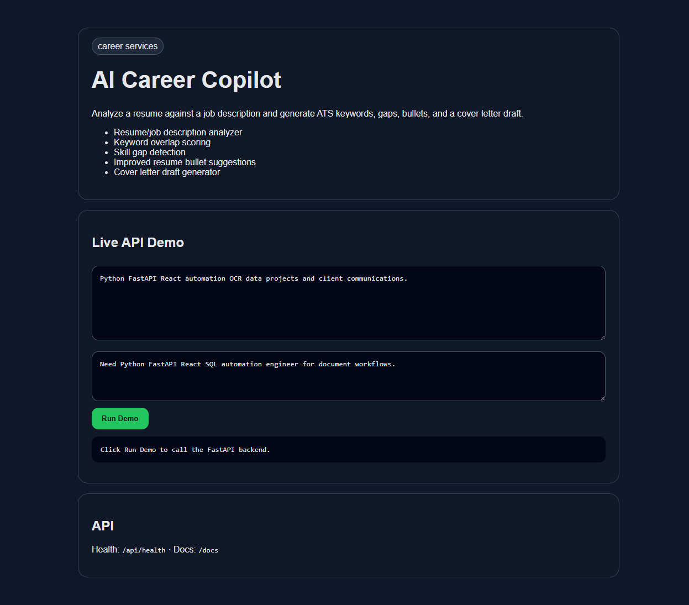

# AI Career Copilot

    

Analyze a resume against a job description and generate ATS keywords, gaps, bullets, and a cover letter draft.



## Why this project exists

This is a portfolio-ready MVP in the **career services** lane. It demonstrates practical API product thinking, clean documentation, tests, and a working local browser demo.

## Features

- Resume/job description analyzer
- Keyword overlap scoring
- Skill gap detection
- Improved resume bullet suggestions
- Cover letter draft generator

## Tech Stack

- Python 3.11+
- FastAPI
- SQLite
- Vanilla HTML/CSS/JS frontend served by the API
- Pytest API tests

## Quick Start

```bash
uv sync
uv run uvicorn src.main:app --reload --port 8102
```

Then open: http://localhost:8102

Windows one-click launcher: `run.bat`

## API

- `GET /` - browser demo
- `GET /api/health` - health check
- `GET /docs` - interactive FastAPI docs

## Verification

```bash
uv run pytest -q
```

## Roadmap

- Add authenticated user accounts
- Add production deployment config
- Replace deterministic helper logic with local Ollama model calls where useful
- Add screenshots and a short demo GIF
